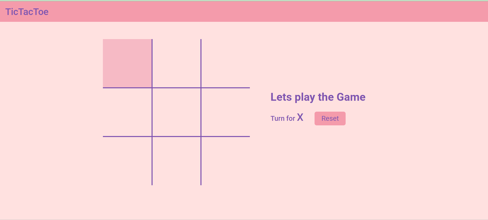
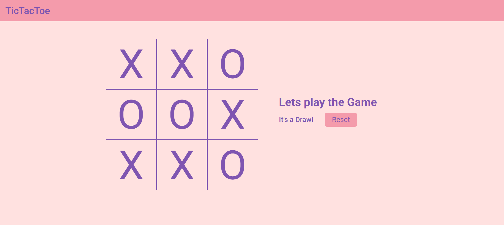

# 🎮 Tic Tac Toe

A simple, interactive Tic Tac Toe game built using **HTML, CSS, and JavaScript**. It supports two-player gameplay, sound effects, and win/draw detection — all in a clean, browser-friendly UI.

---

## 🌐 Live Demo

🔗 [Play Here](https://mythili-velivelli.github.io/TicTacToe/)

---

## 📸 Screenshots

### 🟢 Game Board

### 🏆 Player Wins

### 🔴 Game Over (Draw)

---

## 🧠 What I Learned

- DOM manipulation in JavaScript  
- Handling game state and conditions  
- Adding sound effects to web apps  
- Structuring small web projects

---

## 🛠 Tech Stack

- HTML  
- CSS  
- JavaScript

---

Made with ❤️ by [Mythili Velivelli](https://github.com/Mythili-Velivelli)

